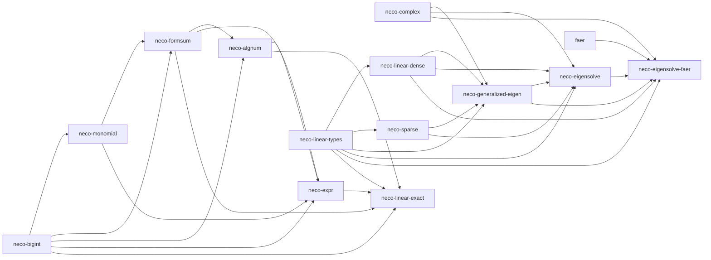

# neco algebra

[English](README.md)

neco algebra は、代数的数を厳密に扱うための Rust crate 群です。数を式のまま保持して計算を進め、浮動小数点への近似は誤差上限を添えた最終段の一回に集約します。

判定はすべて正規形の上で行います。零かどうか、二つの値が同値かどうかは、正規形の構造を照合して決まります。たとえば次の等式は、左辺の乗算結果が正規化で単項の $ 1 $ に到達するため、近似を使わずに確定します。

$$ (\sqrt{3} + \sqrt{2})(\sqrt{3} - \sqrt{2}) = 1 $$

形式和や一般の代数的数の符号は、まず構造として零かどうかを確かめ、零でなければ厳密値を含む区間を必要な幅まで精密化して確定します。

## 依存関係

矢印は依存される crate から、その crate を利用する crate へ向きます。

## crate 一覧

- [`neco-bigint`](neco-bigint): 任意精度の自然数・整数・有理数、二進有理数、検証済みの包含区間
- [`neco-monomial`](neco-monomial): 有理数指数を持つ単項式による冪根の厳密表現
- [`neco-formsum`](neco-formsum): 正規化した単項式の有理係数和
- [`neco-algnum`](neco-algnum): 最小多項式と実根番号で同定する実代数的数
- [`neco-expr`](neco-expr): 誤差上限付き浮動小数点値への式グラフ解決
- [`neco-complex`](neco-complex): 数値線形代数と信号処理の複素スカラー
- [`neco-linear-types`](neco-linear-types): 形状、ベクトル、線形作用素
- [`neco-linear-dense`](neco-linear-dense): 数値線形代数の密行列
- [`neco-sparse`](neco-sparse): 疎行列と COO から CSR への変換
- [`neco-generalized-eigen`](neco-generalized-eigen): 一般化固有値問題、固有空間、射影、収束状態の検証済み型
- [`neco-eigensolve`](neco-eigensolve): 単位質量行列を持つ実対称問題の決定的 Jacobi 固有値計算
- [`neco-eigensolve-faer`](neco-eigensolve-faer): 正定値質量行列を扱う `faer` アダプター
- [`neco-linear-exact`](neco-linear-exact): 有理数、冪根、実代数的数に対する厳密行列、ガウス消去法、連立一次方程式の解

既定の構成は次のとおりです。

- `neco-eigensolve-faer` 以外の crate: 既定で標準ライブラリを使い、既定機能を無効にすると `core + alloc` 構成で利用できます
- `neco-eigensolve-faer`: `faer` の標準ライブラリ機能を使うため、標準ライブラリが必要です

## ライセンス

MIT License です。[LICENSE](LICENSE) を参照してください。
