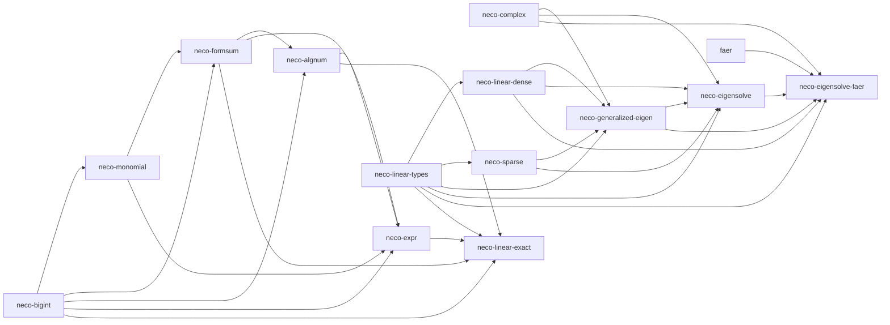

# neco algebra

[日本語](README-ja.md)

`neco algebra` is a set of Rust crates for exact arithmetic over algebraic numbers. A number remains an expression during computation and is converted to a floating-point approximation only once, at the end, with an explicit error bound.

Every decision runs on normal forms. Whether a value is zero, and whether two values are equal, is settled by comparing the structure of their normal forms. For example, the identity

```text
(sqrt(3) + sqrt(2)) * (sqrt(3) - sqrt(2)) = 1
```

is settled without approximation, because the product normalizes to the single term `1`. Sign decisions in the formal-sum and algebraic-number layers first test for structural zero and then refine an enclosing interval to the required width.

## Dependency graph

An arrow points from a dependency to the crate that uses it.



## Crates

- [`neco-bigint`](https://crates.io/crates/neco-bigint): arbitrary-precision naturals, integers, rationals, dyadic rationals, and validated dyadic enclosures.
- [`neco-monomial`](https://crates.io/crates/neco-monomial): monomials with rational exponents that represent radicals exactly.
- [`neco-formsum`](https://crates.io/crates/neco-formsum): rational linear combinations of normalized monomials.
- [`neco-algnum`](https://crates.io/crates/neco-algnum): real algebraic numbers identified by a minimal polynomial and a real-root index.
- [`neco-expr`](https://crates.io/crates/neco-expr): expression graphs resolved to certified floating-point values.
- [`neco-complex`](https://crates.io/crates/neco-complex): complex scalars for numerical linear algebra and signal processing.
- [`neco-linear-types`](https://crates.io/crates/neco-linear-types): shapes, vectors, and linear operators.
- [`neco-linear-dense`](https://crates.io/crates/neco-linear-dense): dense matrices for numerical linear algebra.
- [`neco-sparse`](https://crates.io/crates/neco-sparse): sparse matrices and COO-to-CSR conversion.
- [`neco-generalized-eigen`](https://crates.io/crates/neco-generalized-eigen): validated types for generalized eigenvalue problems, eigenspaces, projectors, and convergence states.
- [`neco-eigensolve`](https://crates.io/crates/neco-eigensolve): deterministic Jacobi eigensolvers for real symmetric problems with identity mass matrices.
- [`neco-eigensolve-faer`](https://crates.io/crates/neco-eigensolve-faer): a `faer` adapter for positive-definite mass matrices.
- [`neco-linear-exact`](https://crates.io/crates/neco-linear-exact): exact matrices, Gaussian elimination, and linear-system solutions over rational, radical, and real algebraic values.

## Repositories using this repository

- [`neco-calculus`](https://github.com/barineco/neco-calculus): exact polynomial calculus.
- [`neco-geometry`](https://github.com/barineco/neco-geometry): exact algebraic geometry computation.

Runtime configurations:

- Every crate except the `faer` adapter: standard library by default, with a `core + alloc` configuration available
- The `faer` adapter: requires the standard library

## License

MIT License. See [LICENSE](LICENSE).
